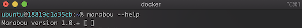

# scad_tot Docker Image

The [scad_tot docker image](https://hub.docker.com/r/grese/scad_tot) is an image based on the [grese/marabou](https://hub.docker.com/r/grese/marabou) docker image, also including the [scad_tot](https://github.com/grese/scad_tot) network and verification code.

## Features

Includes all features provided by the [grese/marabou](https://hub.docker.com/r/grese/marabou) image, plus...

* Includes [scad_tot](https://github.com/grese/scad_tot) code

## Usage

### Get the image

**%** `docker pull grese/scad_tot`

### Start a container

**%** `docker run -it grese/scad_tot /bin/zsh`

### Saving & restoring container state

The following commands for saving/restoring container's state should be run from your host machine *(not from within the container)*.

#### Saving container state

**%** `docker commit <CONTAINER_ID> my_saved_container`

#### Restoring saved container

**%** `docker run -it my_saved_container /bin/zsh`

The <CONTAINER_ID> will be the same as the container's hostname, which is shown in the terminal prompt. For example, the <CONTAINER_ID> of the screenshot below is 18819c1a35cb. The saved container's name (my_saved_container) can be whatever you want.

